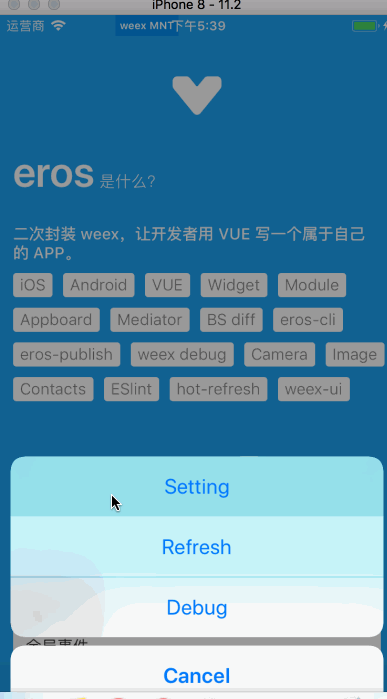
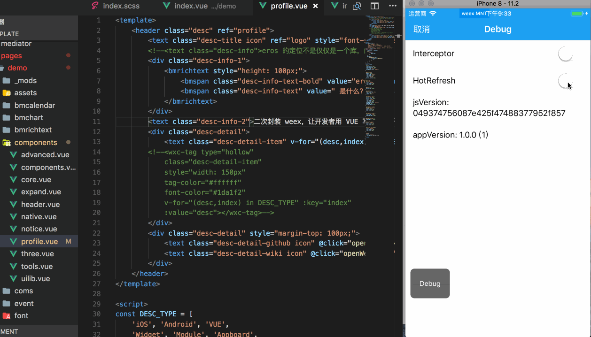

## 实时预览
eros 支持实时预览，即修改完代码可以立即查看效果 **<现已不在需要开启代理工具>**

### 1. 开启开发服务

在项目根目录中起开发服务：

```
$ eros dev
```

脚手架会在项目根目录下生成 dist 文件，存放 JS Bundle。

### 2.关闭拦截器



运行App，点击屏幕上的`debug`按钮-&gt; `Setting` -&gt; `Interceptor` 关闭拦截器，然后点击`Refresh`或者双击屏幕上`debug`按钮刷新页面，就会重新从服务器加载最新的 js 文件。

> 拦截器的主要作用就是控制加载 js 文件的方式
> - 打开状态：会从当前工程内置的资源中加载js资源文件；<br>
> - 关闭状态：就会从开发服务上加载js资源文件；

**注**：使用`真机`调试需要将手机与起服务的pc连接到**同一个局域网内！！！**

## 热刷新
eros 现已支持热刷新，即修改完代码保存（command + s）的时候，页面会自动刷新<br>
- 点击屏幕上的`debug`按钮-&gt; `Setting` -&gt; 打开`HotRefresh`开关，提示 “hot refresh connected.”，说明热刷新以开启

**注**：热刷新只有在`eros dev`起服务，并且关闭拦截器的情况下才会生效 
<br>
<br>



## weex debug 真机断点调试


1. 重复上面真机调试的所有步骤。
2. 执行命令：`$ weex debug`，执行完毕后会自动唤起 Chrome 浏览器打开调试主页，并展示出了二维码。
3. 在App中，点击屏幕上的调试按钮在弹出框中点击`调试`，呼出扫一扫，对准二维码。
4. 选择 Debugger 即可断点调试(这时候页面是空白的，只能调试逻辑代码)，点击 Inspector 即可查看页面结构。


