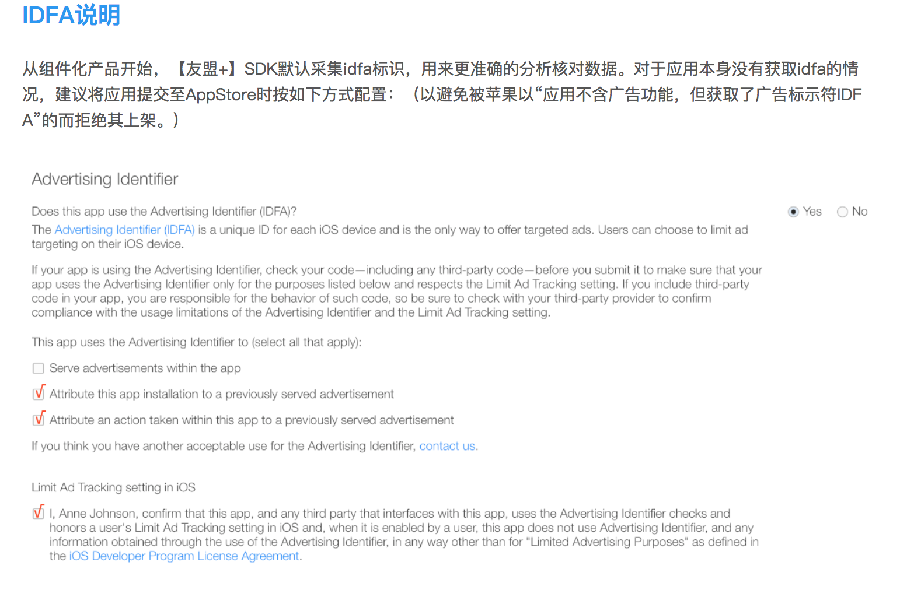

# bmUMAnalytics

> 功能简介：该插件集成了友盟统计SDK，目前只支持基本的数据统计，比如装机量，用户数据等，用法非常简单，只需要调用初始化方法即可；


## 集成方式
**iOS集成方式**

* 打开iOS目录`工程目录/platforms/ios/WeexEros`，编辑Podfile文件，添加`ErosPluginUMAnalytics`组件的引用，添加代码如下，**注意**版本号改为最新的版本（请看change log）

	```ruby
	def common
    	...忽略其他库的引用
    	# 在这里添加引用 ErosPluginUMAnalytics
    	pod 'ErosPluginUMAnalytics', :git => 'https://github.com/bmfe/eros-plugin-ios-UMAnalytics.git', :tag => '版本号'
	end
	target 'WeexEros' do
    	common
	end
	```

* 在终端中`cd`到此目录下执行 `pod update`，等待命令执行完毕，重新运行项目即可。

**Android集成方式**

* 进入Android目录`工程目录/platforms/android/WeexFrameworkWrapper/` 目录下 clone 对应的插件。

``` ruby
	git clone https://github.com/bmfe/eros-plugin-android-UMAnalytics.git "erospluginum"
```

* 打开Android目录`工程目录/platforms/android/WeexFrameworkWrapper/`,编辑`settings.gradle`,添加引入。
在`settings.gradle` 中 添加如下代码。

``` ruby
//这里只需要在最后添加 , ':erospluginum'
include ':app',':sdk',':nexus', ':wxframework', ':erospluginum'  
```

* 打开Android目录`工程目录/platforms/android/WeexFrameworkWrapper/app`,编辑app目录下`build.gradle` 文件 `dependencies` 下添对应 插件引用。

``` ruby
	dependencies {
		....
		//umeng
    	compile project(':erospluginum')
	}
```
* 点击右上角 `Sync Now`

## 使用

**引用Module**

```js
var bmUMAnalytics = weex.requireModule('bmUMAnalytics')
```

**API**

* 初始化友盟SDK `initUM('appkey')` 

	> 调用此方法初始化友盟SDK

	```js
	bmUMAnalytics.initUM('友盟平台申请的appkey')
	```
	
* 统计事件次数 `event('eventId')` 

	> 自定义事件,数量统计.
使用前，请先到友盟App管理后台的设置->编辑自定义事件 中添加相应的事件ID，然后在工程中传入相应的事件ID

	```js
	bmUMAnalytics.event('clickLogin')
	```

* 统计页面展示时长 开始 `beginPage('pageName')` , 结束`endPage('pageName')`

	> 必须成对调用，可结合`eros`页面生命周期统计页面展示时长

	```js
	// 页面展示时调用
	bmUMAnalytics.beginPage('pageName')
	// 页面关闭时调用
	bmUMAnalytics.endPage('pageName')
	```
	
* 统计事件时长 开始 `beginEvent('eventId')` , 结束`endEvent('eventId')`

	> 必须成对调用，可结合`eros`页面生命周期统计页面展示时长

	```js
	// 事件开始调用
	bmUMAnalytics.beginEvent('eventId')
	// 事件结束调用
	bmUMAnalytics.endEvent('eventId')
	```

## 注意事项
**iOS 提交审核** 时需要正确设置 IDFA 选项，如下图


## Change Log

**iOS 1.0.1** <br>
1.添加自定义事件统计api；

**iOS 1.0.0** <br>
1.集成友盟统计；

**Android 1.0.0** <br>
1.集成友盟统计；

