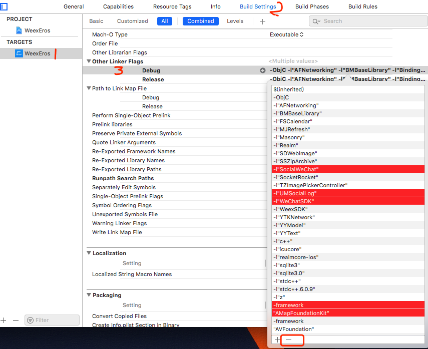
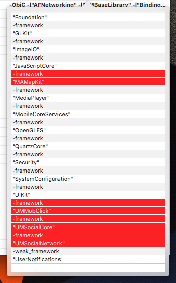

## 2019.03.04
### 重点更新
* [iOS-update] 升级适配 WeexSDK 0.21.0 版本；
* [iOS-update] 基础库（ErosPluginBaseLibrary）更新 1.3.5 版本;

 >  说明：由于 Android 新版本 WeexSDK 变化较大，升级需要修改的地方过多，请再给小哥哥一些时间，迟一些发布更新；

### iOS 升级
编辑 Podfile 修改 `WeexSDK`、`WXDevtool`、`ErosPluginBaseLibrary` 三个库的引用

```ruby
#WeexSDK
pod 'WeexSDK', :git => 'https://github.com/bmfe/incubator-weex.git'
#Weex debugger 调试工具，只在开发模式集成
pod 'WXDevtool', :git => 'https://github.com/bmfe/weex-devtool-iOS.git', :configurations => ['Debug']
#Eros iOS 基础库
pod 'ErosPluginBaseLibrary', :git => 'https://github.com/bmfe/eros-plugin-ios-baseLibrary.git', :tag => '1.3.5'
```
2.执行 `pod update` 拉取新版本依赖；

## 2018.11.23
### 重点更新
* [iOS-update] 解决WeexSDK 与 微信SDK`WXLogLevel`命名冲突问题，请按下面的方式修复WeexSDK依赖方式，继续；
* [iOS-update] 基础库（ErosPluginBaseLibrary）更新 1.3.4 版本，1.优化App启动逻辑，避免热更新时重复初始化Weex环境；2.解决BMEvent `off` 方法不能取消监听事件的问题；
* [iOS-教程] 升级 Xcode 10后会编译报错，请参考这篇文章来解决相关问题；[请戳这里](https://www.jianshu.com/p/6d94278d62b3)
* WeexSDK 0.19.0 更新内容 [请戳这里](https://github.com/apache/incubator-weex/releases) <br>

 >  说明：由于 Android 新版本 WeexSDK 变化较大，升级需要修改的地方过多，请再给小哥哥一些时间，迟一些发布更新；

### iOS 升级
1.修改 WeexSDK 依赖Eros仓库版本 0.19 <br>
2.修改 ErosPluginBaseLibrary 基础库为 1.3.4 版本

```ruby
# 其他依赖库不用修改
pod 'WeexSDK', :git => 'https://github.com/bmfe/WeexiOSSDK.git', :tag => '0.19'
pod 'ErosPluginBaseLibrary', :git => 'https://github.com/bmfe/eros-plugin-ios-baseLibrary.git', :tag => '1.3.4'
```
2.执行 `pod update` 拉取新版本依赖；

## 2018.11.14
### 重点更新
* [iOS-update] 适配WeexSDK 0.19.0版本，基础库（ErosPluginBaseLibrary）更新 1.3.3 版本；
* [iOS-教程] 升级 Xcode 10后会编译报错，请参考这篇文章来解决相关问题；[请戳这里](https://www.jianshu.com/p/6d94278d62b3)
* WeexSDK 0.19.0 更新内容 [请戳这里](https://github.com/apache/incubator-weex/releases) <br>

 >  说明：由于 Android 新版本 WeexSDK 变化较大，升级需要修改的地方过多，请给小哥哥一些时间，迟一些发布更新；

### iOS 升级
1.修改 WeexSDK 依赖版本 0.19.0 <br>
2.修改 ErosPluginBaseLibrary 基础库为 1.3.3 版本

```ruby
# 其他依赖库不用修改
pod 'WeexSDK', '0.19.0'
pod 'ErosPluginBaseLibrary', :git => 'https://github.com/bmfe/eros-plugin-ios-baseLibrary.git', :tag => '1.3.3'
```
2.执行 `pod update` 拉取新版本依赖；

## 2018.10.11
### 重点更新
* [iOS-bugfix] 修复拓展的上拉加载更多loadMore事件与weex默认的loadmore事件冲突的问题；感谢 陈远•Frank，M、的贡献，[文档请戳](https://bmfe.github.io/eros-docs/#/zh-cn/base_extend?id=上拉加载更多)
* [iOS-bugfix] 修复iPhoneX的判断方法；感谢 Shawn唐的贡献；
* [iOS-bugfix] 修复使用Xcode10开发并运行在iOS12系统上设置导航栏背景色无效的问题；
* [iOS-bugfix] 解决使用`bmBundleUpdate`module进行热更新，当解压缩失败时没有回调callback的问题；
* [iOS-optimize] 网络请求一些代码优化；
* [iOS-update] 基础库包名已修改（ErosPluginBaseLibrary）；
* [iOS-教程] 升级 Xcode 10后会编译报错，请参考这篇文章来解决相关问题；[请戳这里](https://www.jianshu.com/p/6d94278d62b3)
* [Android-update] 基础库包名已修改（所有 com.benmu 的包名均修改成 com.eros）；

### iOS 升级
1.升级 ErosPluginBaseLibrary 基础库为 1.3.2 版本

```ruby
pod 'ErosPluginBaseLibrary', :git => 'https://github.com/bmfe/eros-plugin-ios-baseLibrary.git', :tag => '1.3.2'
```
2.执行 `pod update` 拉取新版本依赖；

### Android 升级
1、模板代码修改 `/platforms/android/WeexFrameworkWrapper/app/src/main/AndroidManifest.xml`文件[参考此文件](https://github.com/bmfe/eros-template/blob/master/platforms/android/WeexFrameworkWrapper/app/src/main/AndroidManifest.xml)。<br/> 其他 `com.eros.wx（老包 是 com.benmu.wx）` 包下 文件也需要对应修改[参考此目录](https://github.com/bmfe/eros-template/tree/master/platforms/android/WeexFrameworkWrapper/app/src/main/java/com/eros/wx)。

> 如果您已经自己修改包名 则不需要 修改 模板里的代码。 只需要更新库目录下的代码即可

2、其他库目录可 直接 切换到 一下`tag`， 如并未使用tag 可直接 `git pull `获取最新代码即可。
```
nexus 1.1.0
wxframework 1.1.1
erospluginwxshare 1.1.2
erospluginwxpay 1.1.2
erosplugingt 1.1.1
```

3、 如果有对eros 代码做深度定制开发的同学 升级遇到什么问题可以群里直接 @jony


## 2018.09.06
### 重点更新
* [bugfix]友盟分享接口，添加`userName`字段，分享至小程序需要传入此值；
* [feature]友盟统计新增自定义事件统计；[文档请戳](https://bmfe.github.io/eros-docs/#/zh-cn/plugin_umAnalytics)
* [feature]更新Umeng 库。
* [feature]安卓添加虚拟按键高度全局属性 virtualButtonsHeight
* [bugfix]input组件，type为number时不能输入小数点
* [bugfix]安卓安全漏洞
* [bugfix]修复微信支付模块 isInstallWXApp方法无效问题.
* [bugfix]修复判断前后台方法错误问题.

### iOS 升级
1.升级 ErosPluginUMAnalytics 库为 1.0.1 版本；
2.升级 ErosPluginWXShare 库为 1.0.5 版本；

```ruby
pod 'ErosPluginUMAnalytics', :git => 'https://github.com/bmfe/eros-plugin-ios-UMAnalytics.git', :tag => '1.0.1'
pod 'ErosPluginWXShare', :git => 'https://github.com/bmfe/eros-plugin-ios-wxshare.git', :tag => '1.0.5'
```
2.执行 `pod update` 拉取新版本依赖；

### Android 升级
进入 `/platforms/android/WeexFrameworkWrapper/nexus` 目录 切换tag 到 1.0.9 <br>
进入`/platforms/android/WeexFrameworkWrapper/wxframework` 目录 切换tag 到1.1.0 <br>
进入 `/platforms/android/WeexFrameworkWrapper/erospluginum` 目录 切换tag 到 1.0.1 <br>
进入 `/platforms/android/WeexFrameworkWrapper/erospluginwxpay` 目录 切换tag 到 1.1.1 <br>
进入 `/platforms/android/WeexFrameworkWrapper/erospluginumeng` 目录 切换tag 到 1.1.1 <br>

> 如果您没有使用tag控制版本，可以直接 git pull 更新下github 上代码即可。如果您并没有使用到这些插件则不需要切换tag或者git pull

由于更新了 umeng相关库，以及修复一些安全漏洞同时对模板也做了一些修改，请对应修改一下文件。
1. com.benmu.wx.wxapi  包 目录下的 `WXEntryActivity` 和 `WXPayEntryActivity`
2. `/platforms/android/WeexFrameworkWrapper/app/src/main/AndroidManifest.xml` 

> 如果您并没有对这些文件做修改可以直接 下载文件覆盖即可。


## 2018.08.02
### 重点更新
* [bugfix-iOS]`<web>`标签加载`bmlocal`资源报错的问题；
* [feature]`bmNavigator` module 添加隐藏状态栏功能；[文档请戳](https://bmfe.github.io/eros-docs/#/zh-cn/eros_sdk_module?id=bmnavigator)
* [feature]`bmBundleUpdate` module 添加获取 JSVersion 方法；[文档请戳](https://bmfe.github.io/eros-docs/#/zh-cn/eros_sdk_module?id=bmbundleupdate)
* [optimize]`bmchart`component 支持加载自定义 html 文件；[文档请戳](https://bmfe.github.io/eros-docs/#/zh-cn/eros_sdk_component?id=图表组件)

### iOS 升级
1.升级 BMBaseLibrary 基础库为 1.3.0 版本

```ruby
pod 'ErosPluginBaseLibrary', :git => 'https://github.com/bmfe/eros-plugin-ios-baseLibrary.git', :tag => => '1.3.0'
```
2.执行 `pod update` 拉取新版本依赖；

### Android 升级
进入 `/platforms/android/WeexFrameworkWrapper/nexus` 目录 切换tag 到 1.0.8 <br>
进入`/platforms/android/WeexFrameworkWrapper/wxframework` 目录 切换tag 到1.0.9 。

> 如果您没有使用tag控制版本，可以直接 git pull 更新下github 上代码即可。

## 2018.07.26
### 重点更新
* [bugfix-Android]`tabbar` 多页面 `watchIndex` 只有一个生效问题
* [bugfix-Android]`tabbar` 生命周期触发不正常问题。
* [bugfix-Android]`tabbar` 设置 Navigator 会设置多个`tab`问题
* [bugfix-Android] 提交google play收到SSL Error Handler错误问题添加文档说明。[文档请戳](https://bmfe.github.io/eros-docs/#/zh-cn/QA?id=q-android-%E6%8F%90%E4%BA%A4google-play%E6%94%B6%E5%88%B0ssl-error-handler%E9%94%99%E8%AF%AF)
* [bugfix-Android] 解决部分页面内存泄漏问题
* [bugfix-Android] 优化图片加载过多 的OOM 问题。
* [bugfix-Android] `web`标签通过url传参参数丢失问题；
* [bugfix-iOS] `web`标签通过url传参参数丢失问题；
* [bugfix-iOS] 微信分享插件、微信支付插件判断是否安装微信方法无效的问题（请升级最新版本）；
* [optimize-iOS] 优化 `bmChart` 加载本地js资源的方法；


### iOS 升级
1.升级 BMBaseLibrary 基础库为 1.2.9 版本

```ruby
pod 'ErosPluginBaseLibrary', :git => 'https://github.com/bmfe/eros-plugin-ios-baseLibrary.git', :tag => => '1.2.9'
```
2.执行 `pod update` 拉取新版本依赖；

3.使用微信支付或微信分享的用户请分别升级插件库到最新版本；

### Android 升级
进入 `/platforms/android/WeexFrameworkWrapper/nexus` 目录 切换tag 到 1.0.7 <br>
进入`/platforms/android/WeexFrameworkWrapper/wxframework` 目录 切换tag 到1.0.8 。

> 如果您没有使用tag控制版本，可以直接 git pull 更新下github 上代码即可。


## 2018.07.18
### 重点更新
* [bugfix-Android]`input`标签动态切换`type = password`不生效；
* [bugfix-Android]从后台进入app、tabbar上所有页面都会触发生命周期，应该只有当前显示的页面触发；
* [bugfix-Android]`image`标签动态设置高度图片变形；
* [bugfix-Android]加载本地`html`参数丢失的问题；
* [bugfix-iOS]加载本地`html`参数丢失的问题；
* [bugfix-iOS]`mediator.js`中使用`bmRouter`跳转页面无效;
* [feature]`bmTabbar` 新增监听切换页面方法、获取当前下标方法、及动态修改tabbar配置信息。[文档请戳](https://bmfe.github.io/eros-docs/#/zh-cn/eros_sdk_module?id=bmTabbar)；
* [feature-Android]更新`jsbundle`添加弹窗提示，行为保持跟iOS一致；
* [feature]新增`bmBundleUpdate`module，开发者可以自定义更新`jsbundle`逻辑。[文档请戳](https://bmfe.github.io/eros-docs/#/zh-cn/eros_sdk_module?id=bmBundleUpdate)；
* [feature]`weex.config.eros`中添加`tabbarHeight`原生`TabBar`高度参数；
* [feature]`bmImage`module 新增 `scanImage()`方法，识别图片二维码。[文档请戳](https://bmfe.github.io/eros-docs/#/zh-cn/eros_sdk_module?id=bmimage)；感谢 [scholar-ink](https://github.com/scholar-ink)提供pr；
* [feature]`bmRouter`module 添加 `claerHomePage()` 方法清楚之前设置的首页;
* [feature]新增友盟统计插件。[使用文档请戳](https://bmfe.github.io/eros-docs/#/zh-cn/plugin_umAnalytics)

### iOS 升级
1.升级 BMBaseLibrary 基础库为 1.2.8 版本

```ruby
pod 'ErosPluginBaseLibrary', :git => 'https://github.com/bmfe/eros-plugin-ios-baseLibrary.git', :tag => => '1.2.8'
```
2.执行 `pod update` 拉取新版本依赖；

### Android 升级
进入 `/platforms/android/WeexFrameworkWrapper/nexus` 目录 切换tag 到 1.0.6 <br>
进入`/platforms/android/WeexFrameworkWrapper/wxframework` 目录 切换tag 到1.0.7 。

> 如果您没有使用tag控制版本，可以直接 git pull 更新下github 上代码即可。

## 2018.07.04
### 重点更新
* [bugfix-iOS]修复debug按钮不兼容iPad8.0系统的问题；感谢 [zhongdong](https://github.com/zhongdom)提的pr；
* [bugfix-iOS]修复原生tabbar设置上边栏颜色不生效的问题； 感谢 [zhongdong](https://github.com/zhongdom)提的pr；
* [bugfix-Android]修复fetch传递参数不是字符串时导致的崩溃问题。
* [bugfix-Android]修复tabbar 切换不触发生命周期。
* [feature]`<image>`标签支持 base64图片格式；
* [feature]`$router.toWebview` 支持 `bmlocal` 机制加载`jsbundle`中 html 文件；
* [feature] `<web>` 标签及 `$router.toWebview`新增 web 与 weex 交互机制，详情请看[教程](/zh-cn/base_extend?id=web-%E4%B8%8E-weex-%E4%BA%A4%E4%BA%92)；


### iOS 升级
1.升级 BMBaseLibrary 基础库为 1.2.7 版本

```ruby
pod 'ErosPluginBaseLibrary', :git => 'https://github.com/bmfe/eros-plugin-ios-baseLibrary.git', :tag => => '1.2.7'
```
2.执行 `pod update` 拉取新版本依赖；

### Android 升级

进入 `/platforms/android/WeexFrameworkWrapper/nexus` 目录 切换tag 到 1.0.5 <br>
进入`/platforms/android/WeexFrameworkWrapper/wxframework` 目录 切换tag 到1.0.6 。

> 如果您没有使用tag控制版本，可以直接 git pull 更新下github 上代码即可。


## 2018.06.21
### 重点更新
* [bugfix-Android]解决无法获取联系人问题；
* [bugfix-Android]解决Tabbar 无法连接 weex-debugger 问题；
* [bugfix-Android]解决导航栏 在4.4.4Androud 版本兼容性问题；
* [bugfix-Android]解决拍照 allowCrop 不生效问题 ；
* **重中之重** 修改Android使用插件源码依赖使用;
* [Android] wxframework 库最新tag 为1.0.5 版本
* [Android] nexus 库最新 tag 为 1.0.4版本
* [feature] 新增`bmTabbar`Module，支持设置tabbar数字角标及红点 [文档请戳](https://bmfe.github.io/eros-docs/#/zh-cn/eros_sdk_module?id=bmTabbar)；
* [bugfix-iOS]修复mediator.js中使用router跳转页面无效的问题；
* [update-iOS]优化请求失败返回错误信息的逻辑；

### iOS 升级
1.升级 BMBaseLibrary 基础库为 1.2.6 版本

```ruby
pod 'ErosPluginBaseLibrary', :git => 'https://github.com/bmfe/eros-plugin-ios-baseLibrary.git', :tag => => '1.2.6'
```
2.执行 `pod update` 拉取新版本依赖；

### Android 升级
* 打开`/platforms/android/WeexFrameworkWrapper/` 目录下 install.sh 文件，将其替换成[install.sh](https://github.com/bmfe/eros-template/blob/demo/platforms/android/WeexFrameworkWrapper/install.sh)

> 如果您是全插件使用的话 请替换成[install.sh](https://github.com/bmfe/eros-template/blob/source/platforms/android/WeexFrameworkWrapper/install.sh)

* 打开`/platforms/android/WeexFrameworkWrapper/` 目录下 `setting.gradle` 文件,将其替换成[settings.gradle](https://github.com/bmfe/eros-template/blob/demo/platforms/android/WeexFrameworkWrapper/settings.gradle)

> 如果您是全插件使用的话 请替换成[settings.gradle](https://github.com/bmfe/eros-template/blob/source/platforms/android/WeexFrameworkWrapper/settings.gradle)

* 打开`/platforms/android/WeexFrameworkWrapper/app` 目录下 `build.gradle` 文件,修改其内容

``` java
dependencies {
    ......
    //eros base
    implementation 'com.github.bmfe.eros-nexus:nexus:1.0.3'
    implementation 'com.github.bmfe:WeexErosFramework:1.0.4'
}
// 将其库替换成如下。

dependencies {
    ......
     //基础库
    compile project(':nexus')
    compile project(':wxframework')
}
```

> 具体 `build.gradle` 您可以参考。[pure build.gradle](https://github.com/bmfe/eros-template/blob/demo/platforms/android/WeexFrameworkWrapper/app/build.gradle)<br/> 如果您使用的是 全插件的请参考[source build.gradle](https://github.com/bmfe/eros-template/blob/source/platforms/android/WeexFrameworkWrapper/app/build.gradle)


* 执行 `/platforms/android/WeexFrameworkWrapper/` 目录下 `install.sh` 文件

## 2018.06.06
### 重点更新
* [bugfix-Android]解决Tabbar 刷新崩溃问题；
* [bugfix-Android]修复 input 标签 v-model 有时不生效的问题；
* [feature] bmAxios 请求支持 application/x-www-form-urlencoded 表单格式；

### iOS 升级
1.升级 BMBaseLibrary 库为 1.2.5 版本

```ruby
pod 'ErosPluginBaseLibrary', :git => 'https://github.com/bmfe/eros-plugin-ios-baseLibrary.git', :tag => => '1.2.5'
```
2.执行 `pod update` 拉取新版本依赖；

### Android 升级

1. 打开`/platforms/android/WeexFrameworkWrapper/app/build.gradle`,将`dependencies`节点中`framwork`版本更新至1.0.4。
2. SynNow同步项目。


## 2018.05.30
### 重点更新
* 拓展原生 tabBar，现在首页可以使用原生 tabBar 了，用户体验提升一大截；
* $router open 方法添加 backgroundColor 参数，用于设置原生页面的背景颜色，从感官上不会有白屏了；
* axios 请求添加返回 responseHeader；
* bmToolModule 添加监听网络状态方法；
* iOS 修复点击推送消息唤起App崩溃的问题；
* Android 修复border-radius，v-model不生效问题；

### iOS 升级
1.升级 BMBaseLibrary 库为 1.2.4 版本

```ruby
pod 'ErosPluginBaseLibrary', :git => 'https://github.com/bmfe/eros-plugin-ios-baseLibrary.git', :tag => => '1.2.4'
```

2.推送的问题请更新 ErosPluginGeTui 库为 1.0.1 版本

```ruby
pod 'ErosPluginGeTui', :git => 'https://github.com/bmfe/eros-plugin-ios-getui.git', :tag => '版本号'
```

3.执行 `pod update` 拉取新版本依赖；

### Android 升级
历史版本升级进行如下操作:

1. 打开`/platforms/android/WeexFrameworkWrapper/app/build.gradle`,将`dependencies`节点中`nexus`和`framwork`版本更新至1.0.3,如果依赖了eros插件,可将其他插件版本更改为1.1.0版本（Amap、个推、share、pay）。最后,删除最上方`apply plugin: 'eros-revan'`。

2. 打开`/platforms/android/WeexFrameworkWrapper/build.gradle`,在`dependencies`节点删除`classpath 'com.benmu.eros:eros-raven:1.0.0'`。

3. 将目录`/platforms/android/WeexFrameworkWrapper/app/src/main/java/com/benmu/wx/activity`替换为[链接](https://github.com/bmfe/eros-template/tree/demo/platforms/android/WeexFrameworkWrapper/app/src/main/java/com/benmu/wx/activity)目录。
4. 将 `/WeexFrameworkWrapper/app/src/main/res/layout` 目录下仅保留 `activity_splash.xml` 其他xml 文件删除
5. 找到`/platforms/android/WeexFrameworkWrapper/app/src/main/AndroidManifest.xml`中`MainActivity`的节点将其替换为
```
<activity android:name="com.benmu.framework.activity.MainActivity"
            android:windowSoftInputMode="adjustResize">
            <intent-filter>
                <action android:name="android.intent.action.VIEW"/>

                <category android:name="android.intent.category.DEFAULT"/>
                <category android:name="${APP_ID}.categoty.page"/>

                <data android:scheme="http"/>
                <data android:scheme="https"/>
            </intent-filter>
        </activity>
```
5. SynNow同步项目。

### widget (1.0.2-beta.2) 对应更新
`$ cnpm i eros-widget -S`

- [feature] `$router.open` 支持传入背景颜色，有效减少白屏。
- [feature] `$tools.networkStatus, $tools.watchNetworkStatus, $tools.clearWatchNetworkStatus`。

### tabBar 使用说明

1.编辑 `eros.native.js` 文件，添加 tabBar 相关配置信息；[详细文档](https://bmfe.github.io/eros-docs/#/zh-cn/base_config)

```js
tabBar: {
        color: '#777777',
        selectedColor: '#00b4cb',
        backgroundColor: '#fafafa',
        borderColor: '#dfe1eb',
        list: [{
                pagePath: '/pages/demo/router/tabbarItem1.js',
                text: '首页',
                icon: 'bmlocal://assets/TabBar_Item1@2x.png',
                selectedIcon: 'bmlocal://assets/TabBar_Item1_Selected@2x.png',
                navShow: 'true',
                navTitle: "首页"
            },
            {
                pagePath: '/pages/demo/router/tabbarItem2.js',
                text: '联系人',
                icon: 'bmlocal://assets/TabBar_Item2@2x.png',
                selectedIcon: 'bmlocal://assets/TabBar_Item2_Selected@2x.png',
                navShow: 'true',
                navTitle: '联系人'
            },
            {
                pagePath: '/pages/demo/router/tabbarItem3.js',
                text: '个人中心',
                icon: 'bmlocal://assets/TabBar_Item3@2x.png',
                selectedIcon: 'bmlocal://assets/TabBar_Item3_Selected@2x.png',
                navShow: 'true',
                navTitle: '我'
            }
        ]
    }
```

2.应用 tabBar: 

* 修改 homePage 为 `tabBar`；
* 或者 调用 $router.setHomePage('tabBar') 方法；

3.编辑完 eros.native.js 文件后重启服务，重启App查看效果；

### 获取 responseHeaders

请求成功后可以通过获取 `resData.header` 来查看 responseHeaders 信息；

```js
/**
 * 请求返回统一拦截器 （可选）
 */
responseHandler (options, resData, resolve, reject) {
    const { status, errorMsg, data } = resData
    // 这里可以解构 header 出来
    if (status !== 200) {
        console.log(`invoke error status: ${status}`)
        console.log(`invoke error message: ${errorMsg}`)
        reject(resData)
    } else {
        // 自定义请求逻辑
        resolve(data)
        // 查看responseHeaders
        resData.header
    }
}
```

## 2018.05.02
### 重点更新
* native端框架大调整，插件拆分；
* 新增 `Eros-Plugin` 将微信分享、高德地图等三方库拆分为插件，可以选择性集成，提高灵活性 [查看详情](https://bmfe.github.io/eros-docs/#/zh-cn/eros_plugin)；
* eros.native.js 中移除 umeng、wechat、amap的配置信息，使用方式请查看[插件集成教程](https://bmfe.github.io/eros-docs/#/zh-cn/plugin_wx_share)；
* eros cli 脚手架更新；
  * 优化 eros init命令：可选择初始化带demo示例的 rich 模板，或者 pure 的纯净版本；
  * 删除 install 命令；
  * 优化 eros update 命令只能跟新template工程文件，更新App原生依赖请看最新文档；

### 新版本

请按教程 [生成项目](https://bmfe.github.io/eros-docs/#/zh-cn/base_init)

### 老版本更新指南
> 更新前请做好备份，由于本次更新 native 端改动较大，建议重新生成项目然后迁移；

**更新脚手架**

```
cnpm i eros-cli -g
```

### iOS 升级

**1.更新工程文件:Podfile、AppDelegate.h、AppDelegate.m**

**注**：如果你对原生文件有修改，请自行 diff；

```
$ eros update template /platforms/ios/WeexEros/Podfile
$ eros update template /platforms/ios/WeexEros/WeexEros/AppDelegate.h
$ eros update template /platforms/ios/WeexEros/WeexEros/AppDelegate.m
```

**2.修改配置文件**

> 在Xcode中：找到Other Linker Flags 并展开，在`Debug`和`Release`中，移除图片中选择的引用，注意：需要将上面的 `-framework`也一同移除




**3.更新iOS依赖**

cd到iOS工程目录platforms/ios/WeexEros 执行pod update命令来拉取iOS工程的依赖
```
$ pod update
```

**4.重新编译运行项目**

### Android 升级

**1.删除源码依赖模块**

> cd到Android工程目录platforms/android/WeexFrameworkWrapper目录下，删除 settings.properties 里多余的module,保留如下
```java
include ':app'
```
**2.删除源码依赖**
打开Android目录`工程目录/platforms/android/WeexFrameworkWrapper/app`,删除app目录下build.gradle 里 `dependencies` 下wxframework引用：

```
compile project(':wxframework')
```

**3.下载几个源码文件** </br>
https://github.com/bmfe/eros-template
项目的 demo分支。 对应覆盖 几个文件  如下：
```
AndroidManifest.xml
SplashActivity.java
AppRegister.java
WXEntryActivity.java
WXPayEntryActivity.java
```

**4.添加依赖插件**
打开Android目录`工程目录/platforms/android/WeexFrameworkWrapper/app`,编辑app目录下build.gradle 文件 `dependencies` 下添加引用，代码如下：

	```ruby
	dependencies {
		....
	//eros base
    compile 'com.github.bmfe.eros-android-worker:eros-framework:eros_v0.0.1'
    //eros plugin
    compile 'com.benmu.eros:plugin-amap:1.0.0'
    compile 'com.benmu.eros:plugin-getui:1.0.0'
    compile 'com.benmu.eros:plugin-wxpay:1.0.0'
    compile 'com.benmu.eros:plugin-wxshare:1.0.0'
	}
	```
* 添加完后，右上角 有一个 sync now。 点击 等待同步完成没有报错证明组件添加成功


## 2018.03.22
### 重点更新
* 全新 demo
* 真机/模拟器(单个/多个) 热刷新
* 开发中代理软件成为可选项，不需要代理软件就可以通过真机/模拟器进行实时修改预览。
* eros.native.js 以后不需要每次 pack 生效，修改完后，重启 eros dev，重新 build app 即可.

> 特别注意：weex-loader 升级之后 sass 中 变量 $ 不生效，确认为官方 weex-loader 问题，已提issues，如果想继续使用，在全局脚手架中自行降级即可

热刷新使用
```js
// eros.dev.js 中添加如下配置 开启 websocket
'socketServer': {
    'port': 8899,
    'switch': true
}
```
然后看自己 eros.native.js url.jsServer 是否还存在，目前已经采取动态ip 写入，你需要删除此项配置，重新 eros dev，build app 即可。
### 新版本 
请直接 init 新项目

### 老版本更新指南
如果 3.14 版本未更新的话，看下面的更新指南。
如果您未变动到开发底层 platforms/android/ 下的文件，请按以下指令更新：
* `cnpm i eros-cli -g` 更新脚手架
* `eros update template package.json`
* `eros update ios`
* `eros update android`
* `rm -rf node_modules` 删除前端依赖
* `cnpm install` 重新下载前端依赖

如果您距离当前版本过久没更新，**强烈建议，重新 `eros init` 进行迁移。**

### eros-cli 2.0.7-beta.3
* [feature] 更新 `weex-loader` 到最新版，支持 recyle-list
* [feature] 添加 socket 服务，支持热刷新可动态代理 ip 写入
* [optimize] 添加 happypack 减少打包体积 

### eros-template 1.0.1-beta.2 `可选更新`
* [feature] 全新的 demo
* [update] 升级了 weex-ui 版本

### eros-widget 1.0.1-beta.8
* [feature] alert/confirm 去掉 message 为空限制

### eros-android-sdk
* [feature] 增加热刷新功能。
* [modify] 修改Input 默认字体为黑色
* [modify] 修改Image标签的 默认加载动画菊花 由 placeholder 属性控制，默认不展示。
* [update] bindingx 升级到了 1.0.2
* [bugfix] 页面旋转崩溃问题 (PR By 韩琉鑫)
* [bugfix] 修改Emit参数类型转化异常
* [bugfix] 修复扫码遇到Json串可能崩溃问题。
* [bugfix] 所有弹窗均改为原生 

### eros-ios-sdk
* [feature] 增加热刷新功能。
* [update] bindingx 升级到了 1.0.1


## 2018.03.14
### 重点更新
* eros android 底层组件化
* 支持 [bindingx](https://bmfe.github.io/eros-docs/#/zh-cn/advanced_bindingx)

### 新版本 
请直接 init 新项目

### 老版本更新指南

如果您未变动到开发底层 platforms/android/ 下的文件，请按以下指令更新：
* `cnpm i eros-cli -g` 更新脚手架
* `eros update template scripts`
* `eros update template package.json`
* `eros update template /platforms/android`
* `eros update ios`
* `rm -rf node_modules` 删除前端依赖
* `cnpm install` 重新下载前端依赖

如果您的 eros 客户端底层变动较大，如下更新比较合适：
* `eros init` 最新模板
* 直接把你项目中的 `src` 目录拷贝进来
* `diff` 底层的变动，进行迁移

如果您变动了不多，请尝试以下更新：
* `cnpm i eros-cli -g` 更新脚手架
* `eros update template scripts`
* `eros update template package.json`
* `eros update template /platforms/android/WeexFrameworkWrapper/settings.gradle`
* `eros update template /platforms/android/WeexFrameworkWrapper/app/build.gradle`
* `eros update template /platforms/android/WeexFrameworkWrapper/app/src/main/java/com/benmu/wx/activity/SplashActivity.java`
* `eros update ios`
* `eros install android` (注意此次安卓升级较大，不得使用 update 命令，如果改动了底层代码覆盖了你得逻辑，还是直接 init 项目来 diff 差别)
* `rm -rf node_modules` 删除前端依赖
* `cnpm install` 重新下载前端依赖

如果您距离当前版本过久没更新，**强烈建议，重新 `eros init` 进行迁移。**

### eros-cli 2.0.6-beta.1 
* [feature] 更新 `weex-loader` 到最新版，支持 recyle-list
* [feature] 添加 socket 服务，准备开发保存自动刷新
* [bugfix] `eros build -d` 报错问题

### eros-template 1.0.1-beta.1 `可选更新`
* [feature] 添加 bindindx demo
* [update] weex-ui demo

### eros-widget 1.0.1-beta.6
* [feature] 支持 $bindingx，重写 $bindingx 的引用方法，重写了 bind 方法，支持所有内部暴露出来的方法
* [bugfix] 父子组件同时注册生命周期，执行两次的 bug

### eros-android-sdk
* [feature] 插件化重构，拆分amap；
* [feature] 集成 BindingX；

* [update] BMChart 修改默认背景颜色为透明；
* [bugfix] 订阅传递纯数字字符是可能有问题；

### eros-ios-sdk
* [feature] 集成 BindingX；
* [feature] BMRouter open方法添加 gesBack字段，控制是否开启手势返回；
* [update] BMChart 修改默认背景颜色为透明；

## 2018.03.07
### 重点更新
* `weex sdk ios/android` 均升级 `0.18.0`
* 告别 `if (process.env.NODE_ENV === 'development') require('Config’)`
* `全局事件`，`生命周期`的使用均优化了名称(可选，需谨慎)

### 老版本更新指南
> 因近期两会原因，还有前不久 github 刚刚遭受了最大的 DDOS 攻击，导致相关操作有些缓慢，甚至会断开，还需要多尝试几次，如若不行，参考 `scripts` 文件夹中的更新脚本，手动进入项目更新即可。

项目根目录下
* `cnpm i eros-cli -g` 更新脚手架
* `eros update template platforms/android/WeexFrameworkWrapper/app/build.gradle` 删除不需要的ndk 架构 (weex sdk 0.18.0 需要)。
* `eros update template platforms/android/WeexFrameworkWrapper/build.gradle` 切换了部分阿里源，加快下载速度。
* `eros update ios` 或 `eros update android`
* `cnpm i` 可选，注意升级完之后需要也需要改代码中原有使用生命周期的代码，[查看文档](https://bmfe.github.io/eros-docs/#/zh-cn/eros_widget?id=%e9%a1%b5%e9%9d%a2%e5%85%a8%e5%b1%80%e4%ba%8b%e4%bb%b6)，如果想保留之前写法，不执行此行代码更新 `eros-widget` 即可。

### eros-cli 2.0.6-beta.1 
* [feature] 添加 	`eros run ios`，当本地环境安装成功可直接运行模拟器。
* [optimize] 优化 自动在 `eros dev` 的时候拼接 appboard js bundle ，从而避免了使用 `if (process.env.NODE_ENV === 'development') require('Config’)`，也解决了 weex debug 中 eros dev 时全局事件会执行两次问题
* [optimize] eslint 支持编译 await/async. (by 阳光只要七十米)

### eros-template 1.0.1-beta.1 `可选更新`
* [optimize] demo 兼容 0.18.0，并做了部分优化。
* [optimize] eslint 支持编译 await/async. (by 阳光只要七十米)

### eros-widget 1.0.1-beta.1 `可选更新`
* [rebuild] 在 mixins.js 中重做了全局事件的注入，并变更为更语义化的单词，使用方法可参考 demo 中的生命周期
```js
export default {
    eros: {
        appActive() {
            console.log('appActive');
        },
        appDeactive() {
            console.log('appDeactive');
        },
        beforeAppear (params, options) {
            console.log('beforeAppear');
        },
        beforeBackAppear (params, options) {
            console.log('beforeBackAppear');
        },

        appeared (params, options) {
            console.log('appeared');
        },

        backAppeared (params, options) {
            console.log('backAppeared');
        },

        beforeDisappear (options) {
            console.log('beforeDisappear');
        },

        disappeared (options) {
            console.log('disappeared');
        },

		pushMessage (options) {
            console.log('pushMessage');
        }
    }
}
```

### eros-android-sdk
* [bugfix] 修复增量更新可能失败问题.
* [update] 集成升级SDK 0.18版本.
* [update] 集成升级 weex-debugger 0.13.4版本.
* [optimize] 修改拦截器关闭不拼接app borad.
* [feature] 增加全局属性 deviceHeight、deviceWidth

### eros-ios-sdk
* [update] 集成升级SDK 0.18版本.
* [optimize] 修改拦截器关闭不拼接app board.

---
## 2018.02.08
开发模板 eros-template v1.0.0：
* [del]: 删除了 widget 目录及其源码
* [del]: 删除了 lodash 依赖
* [add]: 添加了 eros-widget 依赖
* [mod]: 修改了 src/js/config/index widget的引入方式

> eros-widget 目前已经独立出来，欢迎所有开发者 pr，[git地址](https://github.com/bmfe/eros-widget)

脚手架 eros-cli v2.0.5:

* [add]: eros install all 可同时下载两端的 eros-sdk
* [add]: 支持在 init 的时候输入安卓的包名
* [fix]: eros mock 报错问题
* [mod]: eros cli 的帮助日志更新
* [del]: 由于 widget 已提交到 npm 上，目录下不在存在 widget，所以去掉 eros update widget 指令

sdk 相关：
* eros-ios-sdk[fix]: 修复ios读取本地放在assets目录中的gif图时，无法出现动效的问题感谢 shawn-tangsc PR
* eros-ios-sdk[fix]: 修复由于ios系统版本不同导致 调用BMNavigatrModule设置导航栏按钮大小不一致的问题
* eros-android-sdk[fix]: 解决 个推 通知栏点击不跳转问题

文档相关：
* eros-docs[add]: 迁移所有文档，并完善了 QA 部分。

老版本迁移：
1. 升级脚手架
2. 删除 widget 目录
3. cnpm i eros-widget -S
4. 把 src/js/config/index 的引入 widget 的路径替换为 `import Widget from 'eros-widget'`
5. eros update ios or android

---
## 2018.02.01
### 简述：
* 目前可任意使用 echart 的大部分所有实例运行了！！！
* 相同网络状况下减少了 eros install 60% 的时间
* 只有第一次 eros init 模板的时候需要 eros install，其余后续更新只需要 eros update ios/android(没有 -- 哦) 即可，会更快
* 原先的eros update 默认更新模板，现在变更为 eros update template xxxx，xxxx 为你要更新的路径
* widget 单独优化出来一个命令 eros update widget

### eros-template
* 添加 `$format` 支持 bmchart 传递 options 中包含有方法的情况
* add scripts/ios.install.sh
* add scripts/android.install.sh
* add scripts/ios.update.sh
* add scripts/android.install.sh

### ios-sdk
* 适配 weex debug 1.0.0 版本，改回扫一扫调试；
* 修复调用 toast message 传 Number 类型时崩溃的问题;
* 优化 bmchat 图标组件，支持调用方法  setOptions 变更为 options

### android-sdk
* 修复未获得权限时多次点击图片可能出现返回多张图片问题。
* 添加权限申请。
* 将调试修改成扫一扫，并升级 weex debug.
* 修复一些已知 bug
* bmchart 支持传递方法 setOptions 变更为 options

### eros-cli 
* add: eros install ios
* add: eros install android
* add: eros update ios
* add: eros update android
* add: eros update template your_path
* add: eros update widget

---
## 2018.01.24

### eros-template:
* 全新的 demo
* fix widget 中 storage 返回格式不统一的问题
* fix widget 中 this.$image.upload 参数问题

### eros-cli:
* 修复了eros build 会 pack 内置包的bug
* 添加了 eros pack --all 同时打两端内置包

### ios
* 修改bmRouter getParams 没有数据的时候返回空字符串；
* 优化bmRichtText,有一定几率不显示的问题；

### android
* 拓展weex.config.eros变量
* 修复ToolsMoudle 是否安装微信方法
* 修复iconfont不显示问题。
* 修改富文本默认字体
* 修复一些已知bug
* 修复bmCalendar样式不生效问题
* 修复滑动事件影响bmRefresh消失问题
* 修复了上传图片后返回json数组,现在返回对象

### 迁移指南
* 新项目 或者 如果需要查看demo 建议重新 eros init 项目
* 老版本如果更新sdk 只需要 eros install 即可

---
## 2018.01.10
### 脚手架及其模板
* 添加编译时 eslint ，并添加 eslint 对应配置文件，在 `eros.dev.js` 中添加 eslint 参数来配置是否需要在编译时进行 eslint 检测，eslint 默认为false。
* 模板中的所有内置代码全部通过 eslint 进行了修改，增加了代码的规范性。

> 推荐中大型项目，使用开启此项功能，来增加代码的拓展性，维护性，减少 BUG，无用代码等。

特别感谢 **Eric Xiao** 提出了 `eslint` 代码规范的建议，并贡献了 `.eslintrc`，`.editorconfig` 2个文件。

### 安卓
1. 修复axios bug
2. 修复setHomePage方法没有立即生效问题。
3. 修复sms 发短信崩溃问题。
4. 修复调试按钮点击崩溃问题。
5. 修复call方法总是110问题，修改 module 的传参方式，可以配置是否需要弹窗提示拨打。
6. 修复预览本地图片问题。
7. 修改返回格式status问题 统一返回 `Number`

### IOS
1. 修改 module 拨打电话的传参方式
2. 修改返回格式status问题，统一返回 `Number`

---
## 2018.01.05
### 安卓/IOS
* 添加一键调试，不需要扫一扫即可调用调试，模拟器现在也可以调试了；需要在 `eros.native.js` 中添加 `debugServer`，添加方式请看[eros.native.js 配置教程](https://github.com/bmfe/eros-template/wiki/%E9%85%8D%E7%BD%AE%E7%9B%B8%E5%85%B3) (感谢：周晗)
* 新增bmImage Module,将图片相关操作统一放到此Module中
* 支持直接打开相机拍照或直接打开相册选择图片并返回本地路径
* 新增上传本地图片方法，用于上传上面👆选择的图片
* 预览图片支持浏览 网络图片、本地图片及 jsbundle 中的图片
* 优化了bmchat组件，通过修改 html 代码确定内容高度等于 bmchat 组件设置的高度；（感谢：阳光只要七十米）
* 新增 bmWebsocket Module，android 端也可以进行 socket 链接了
* bmRouter Module 新增 setHomePage方法: 作用：重新设置 app 启动加载的首页

### 开发模板
* 增加了新 module 对应的所有 widget，`$image`, `$coms`
* 统一了返回格式，修复了已存在的 BUG （感谢 Eric xiao ）
* Promise 拓展了 `finally` 和 `done` 2 个方法 （感谢 Eric xiao）
